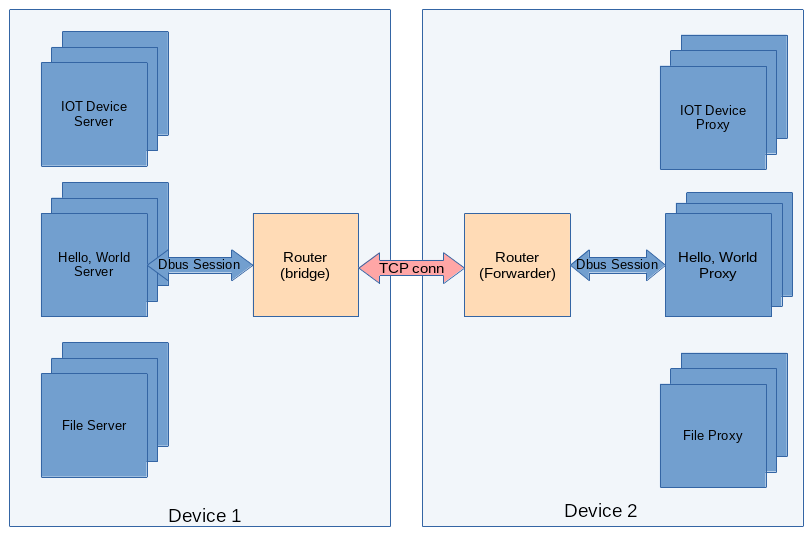
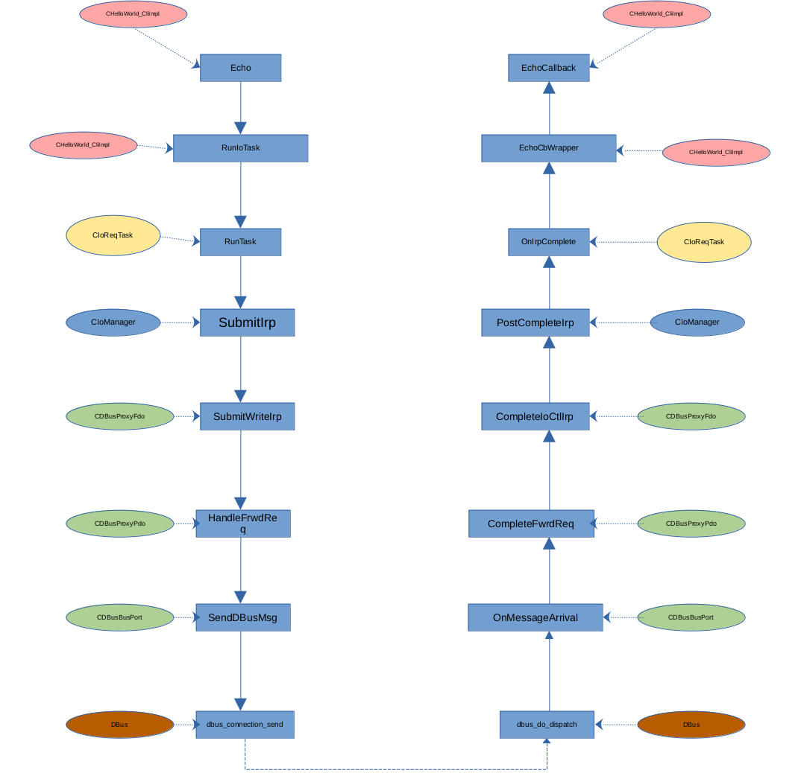
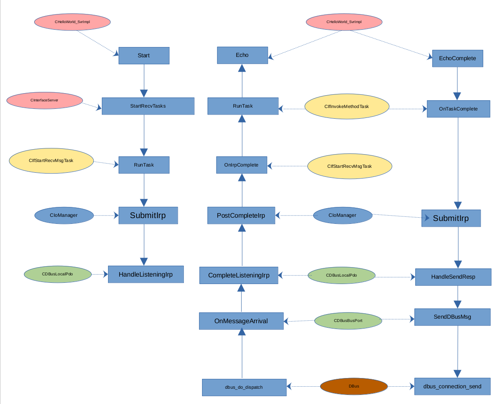

# C++开发教程
## 第O节 rpc-frmwrk编程简介
**本节要点**：   
* rpc-frmwrk的架构和技术特点
* rpc-frmwrk的请求处理流程
* rpc-frmwrk的内存管理

### rpc-frmwrk的架构和技术特点
  * rpc-frmwrk是一个分布式的系统，微服务模式下的系统块图如下图:   
        
  * rpc-frmwrk的各个模块是通过TCP连接，`Unix Socket`和DBus连接在一起，对于用户代码透明，可通过`rpcfg.py`或者配置文件进行设置。
  * 客户端和服务器端程序，以及rpcrouter都是多线程的，完全并发的环境。几乎所有线程都处于各个运行对象共享的状态。
  * ridl文件里，有个[service](../ridl/README_cn.md#语句)的概念。服务器是一个或者数个`service`实例的集合，同样客户端则是一个或者数个`service`实例集合。
  * 服务器端的`service`继承自`CInterfaceServer`，客户端的`service`继承自`CInterfaceProxy`。
  * `CInterfaceServer`或者`CInterfaceProxy`是一个异步I/O操作链条的起点和终点。而中间环节则是一组CTasklet和CPort堆栈组成，
    而系统调用`read``write`或者`poll`处，则是这个I/O链条的转折点。由于操作系统的不同，这个系统调用会有所不同。
  * 如果把从`CInterfaceServer`或者`CInterfaceProxy`开始的I/O链条视为一个I/O单元，那么`rpcrouter`就是管理I/O单元的特殊`service`。这样rpc-frmwrk的所有
    工作几乎都可以通过嵌入或者堆砌这种`service`来构造。
  * rpc-frwmrk请求的收发过程是完全异步的，通过Callback返回服务器响应或者错误码。而客户端的用户代码可以使用同步或者异步两种调用方式，收发请求和响应。
    我们将在下面的课程中，看到这两种情况的应用。
  
### rpc-frmwrk的请求处理流程
  * 下图是客户端RPC请求的异步处理流程。   
        

  * 下图是服务器端RPC请求的异步处理流程。   
        

### rpc-frmwrk的内存管理
rpc-frmwrk定义的Class大部分基于共同的基类CObjBase，并具有唯一的32位`class id`。这使得这些类可以通过类工厂建立，并由引用技术控制对象的生命周期。
一种常用的建立对象实例的方法是使用智能指针，如ObjPtr来建立和持有rpc-frmwrk对象的所有权。比如   
```
ObjPtr pObj;
pObj.NewObj( clsid( CConfigDb2 ));
```
而向`sevice`之类比较复杂的类对象，一般是有配置文件的。这类对象的建立稍微复杂一些，需要传入配置参数。
```
    CParamList oParams;
    oParams[ propIoMgr ] = g_pIoMgr;
    
    ret = CRpcServices::LoadObjDesc(
        strDesc, "HelloWorldSvc",
        false, oParams.GetCfg() );
    if( ERROR( ret ) )
        break;
    ret = pIf.NewObj(
        clsid( CHelloWorldSvc_CliImpl ),
        oParams.GetCfg() );
    if( ERROR( ret ) )
        break;
```

## 有了以上的知识，我们可以更好的理解接下来的教程了