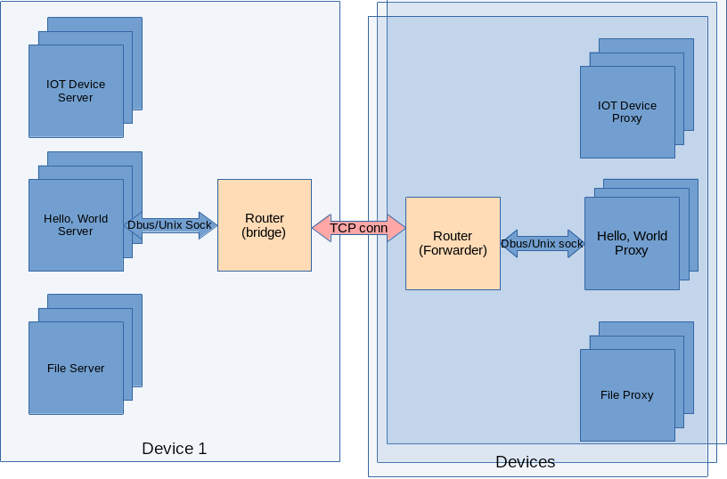

# C++开发教程
## 第O节 rpc-frmwrk编程简介
**本节要点**：   
* rpc-frmwrk的架构和技术特点
* rpc-frmwrk的请求处理流程
* rpc-frmwrk的内存管理
* rpc-frmwrk的线程管理
* rpc-frmwrk的IoManager和Port堆栈

### 目标观众
  * 有一定的编程基础，对C++比较熟悉，并且有开发经验的
  * 计划使用ridl和ridlc开发rpc-frmwrk的开发人员。
  * 对rpc-frmwrk感兴趣或者希望改进rpc-frmwrk的技术爱好者。
  * 对学习异步编程或者C++编程感兴趣的人们。

### rpc-frmwrk的架构和技术特点
  * rpc-frmwrk是一个分布式的系统，微服务模式下的系统块图如下图:   
        
  * rpc-frmwrk的各个模块是通过TCP，`Unix Socket`和DBus连接在一起，连接类型对用户代码透明，可通过`rpcfg.py`或者配置文件进行设置。
  * 客户端和服务器端程序，以及rpcrouter都是多线程的，完全并发的环境。几乎所有线程都处于各个运行对象共享的状态。
  * ridl文件里，有个[service](../ridl/README_cn.md#语句)的概念。服务器是一个或者数个`service`实例的集合，同样客户端则是一个或者数个`service`实例集合。
  * 服务器端的`service`继承自`CInterfaceServer`，客户端的`service`继承自`CInterfaceProxy`。
  * `CInterfaceServer`或者`CInterfaceProxy`是一个异步I/O操作链条的起点和终点。而中间环节则是一组CTasklet和CPort堆栈组成，
    而系统调用`read``write`或者`poll`处，则是这个I/O链条的转折点。由于操作系统的不同，这个系统调用会有所不同。
  * 如果把从`CInterfaceServer`或者`CInterfaceProxy`开始的I/O链条视为一个I/O单元，那么`rpcrouter`就是管理I/O单元的特殊`service`。这样rpc-frmwrk的所有
    工作几乎都可以通过嵌入或者堆砌这种`service`来构造。
  * rpc-frwmrk请求的收发过程是完全异步的，通过Callback返回服务器响应或者错误码。而客户端的用户代码可以使用同步或者异步两种调用方式，收发请求和响应。
    我们将在下面的课程中，看到这两种情况的应用。
  
### rpc-frmwrk的请求处理流程
  * 下图是微服务模式下客户端RPC请求的异步处理流程。   
        

  * 下图是微服务模式下服务器端RPC请求的异步处理流程。   
        

### rpc-frmwrk的内存管理
rpc-frmwrk定义的Class大部分基于共同的基类CObjBase，并具有唯一的32位`class id`。这使得这些类可以通过类工厂建立，并由引用计数控制对象的生命周期。
一种常用的建立对象实例的方法是使用智能指针，如ObjPtr来建立和持有rpc-frmwrk对象的所有权。比如   
```
ObjPtr pObj;
pObj.NewObj( clsid( CConfigDb2 ));
```
当`pObj`退出作用域时，就释放了它所持有的类对象。
而向`sevice`之类比较复杂的类对象，一般是有配置文件的。这类对象的建立稍微复杂一些，需要传入配置参数。
```
    CParamList oParams;
    oParams[ propIoMgr ] = g_pIoMgr;
    
    ret = CRpcServices::LoadObjDesc(
        strDesc, "HelloWorldSvc",
        false, oParams.GetCfg() );
    if( ERROR( ret ) )
        break;
    ret = pIf.NewObj(
        clsid( CHelloWorldSvc_CliImpl ),
        oParams.GetCfg() );
    if( ERROR( ret ) )
        break;
```
### rpc-frmwrk的线程管理
* rpc-frmwrk的线程主要有以下两类：
    * `event loop`线程是处理poll的事件的消息循环。一般用于处理系统的I/O事件。
    * `TaskThread`和`TaskThreadOneshot`是处理任务队列的线程，按照FIFO的顺序处理CTasklet对象。
* 一个rpc-frmwrk的应用程序包含如下的线程：
    * 主线程，rpc-frmwrk的初始化线程
    * `mainloop`，一个单独建立的`event loop`线程，专门用来分发DBus的事件和消息。
    * `CTaskThread`，一个由单独的CTaskThreadPool管理的`TaskThread`线程。个数随处理器的个数的不同而不同，服务器端多于客户端。
    * `UxTask-x`，由CThreadPools管理的`event loop`线程。用于Unix Socket的连接管理。rpcrouter还有`SockLoop-x`用于TCP连接管理的线程。
    * 服务器程序的logger线程，一个专门把log信息上传给log服务器的线程。
    * `CTaskThreadOneshot`线程，动态建立的线程，用于执行一些耗时，不能异步的操作。
    * 除了主线程和`CTaskThreadOneshot`线程可以阻塞之外，其他的线程都只运行非阻塞任务，所以尽量不要在这些线程上长时间的等待，以防性能下降或者死锁等问题。

### rpc-frmwrk的IoManager和Port堆栈
* IoManager是rpc-frmwrk架构里最关键的组件。它的职责有以下几类，
    * 提供驱动程序管理器，负责动态加载卸载指定的Port对象。
    * 提供即插即用管理器负责，建立，启停和销毁Port堆栈
    * 提供注册表分类管理驱动程序和Port对象，以及事件的注册和发布。
    * 绑定Port堆栈实例和CInterfaceProxy或者CInterfaceServer实例。
    * 线程池的建立，管理，和销毁。
    * 管理IRP的提交和完成流程。
    * 定时器管理和日志提交。
* rpc-frmwrk的Port堆栈
    * Port堆栈是一组不同角色的Port对象按照处理的先后顺序，分工协作的I/O数据处理流水线。
    * 可以动态的插入Port对象，实现增加或转换传输协议，调整服务质量，加密解密数据等功能。
    * Port之间通过IRP进行数据发送和侦听，数据的接收和返回，遍历Port堆栈的处理函数，最终调用回调函数等。
      不过这并不排斥Port使用Task。实际上`IRP`有一定的限制，对于多个I/O任务的管理不如`CIfTaskGroup`简便高效，所以两者会结合使用。
    * 在上面的处理流程中的绿色对象是Port堆栈上的Port对象。

## 有了以上的知识，我们可以更好的理解接下来的教程了
[下一讲](./Tut-HelloWorld_cn-1.md)