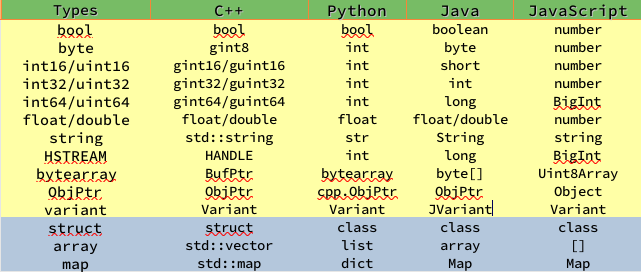

# rpc-frmwrk开发教程
## 第五节 数据类型和序列化
**本节要点**：   
* 理解ridl支持的简单数据类型和复合数据类型
* 发送和接收复杂的数据。
* 编译，运行和检查结果。

### 项目需求
1. 观察ridl定义的数据，和ridlc生成的目标语言下的数据结构
2. 发送和接收一个结构(struct)数据

### 生成EventTest的C++项目框架
本节课我们使用[iftest.ridl](../examples/iftest.ridl)来生成该[项目框架](../examples/cpp/iftest/)。

#### 首先，先看看该ridl里的内容：
  * 在接口IEchoThings上定义了一个叫`Echo`的方法，它的输入参数和输出参数都是GlobalFeatureList类型的结构。
  * `service`关键字定义了一个叫IfTest的服务，和别的服务不同之处是，服务名后面有一个`timeout`的标签。该标签指定了这个服务里的所有方法的默认超时时限是100秒。
  * 我们的重点是学习定义用于传输的复杂结构

#### 用ridlc生成项目框架
  * 在evtest.ridl顶端有生成各个语言的命令行。我们使用标有C++的那行命令。   
    `mkdir iftest; ridlc -Lcn -O ./iftest iftest.ridl`

#### 结构的序列化和其他可序列化的数据类型
  * 主要的流程和结构请参考[HelloWorld](./Tut-HelloWorld_cn-1.md)的讲解。
  * 我们这里关注一下ridlc生成的GlobalFeatureList的声明和定义。
    * 对每一个ridl里声明的结构，ridlc会在目标语言中声明和实现一个同名的结构。
    * 本例中声明了两个结构GlobalFeature和GlobalFeatureList。
    * ridlc会在iftest.h和iftest.cpp中声明和实现这两个结构。iftest.h的命名是ridl中的"应用名appname"+".h"。
      这个头文件里主要是ridl文件里的接口方法的声明，以及结构的声明。与它对应的"iftest.cpp"则是包含接口方法和结构方法的实现。
    * 这两个结构里也有映射(map)和数组的声明。
    * 每一个结构都继承自一个`CStructBase`，里面封装了序列化和反序列化的函数。这个类定义在[seribase.h](../include/seribase.h)
    * 每个结构本身还重载了Serialize和Deserialize两个函数，以及`operator=`，以序列化自己的成员变量。
    * 每一个结构都在类工厂里进行了注册，这样可以在序列化的过程中，可以实现动态的绑定。
    * 数组会被ridlc在C++中转换成std::vector。
    * 映射(map)会被ridlc在C++中转换成std::map。
    * 有关类型的对应关系可以参考。   
        
    * rpc-frmwrk自带了一些可以序列化的容器类，可以直接用于接口参数的类型，这些类型在ridl里就统一表示成ObjPtr，不用指定具体类型。
    * rpc-frmwrk的可序列化容器类声明在[stlcont.h](../include/stlcont.h)。
    * 最常见的rpc-frmwrk的可序列化容器是CConfigDb2, 也就函数参数里常见的`IConfigDb*`。它也可以直接用在接口的参数中, 如果想向对方
      发一个IConfigDb*类型的数据，在ridl里用ObjPtr定义这个参数或者字段。
    * 还有一种ridl里出现的类型是HSTREAM类型，也是可序列化数据类型，它定义的是`流`的句柄，用来唯一标识一个服务器和客户端之间的`流通道`。
      有关它的使用，我们会在后面的课程中介绍。

#### 添加代码：
  * 在客户端，我们在`maincli`中声明和初始化两个GlobalFeatureList和GlobalFeature的变量。
  * 通过同步方法CIfTest_CliImpl::Echo把i0发送给服务器，并在i0r中接收服务器的返回消息。
  * 服务器端的修改也很简单，在CIfTest_SvrImpl::Echo中给输出参数赋值`i0r=i0;`，然后通知系统给客户端返回`i0r`。

#### 问题
  * 序列化/反序列化有协议吗？目前没有成为文档的协议。对用户代码透明。
  * 序列化的格式统一吗？是的，rpc-frwmrk支持的语言使用同样的序列化协议，所以使用不同语言的服务器和客户端可以互联互通。
  * 结构数据类型可以继承吗？目前还没有支持，如果有继承的需求，先用声明数据成员的方式变通一下吧。

#### 编译
  * 在命令行下，我们可以看到在`iftest`目录下有`Makefile`。只要输入`make -j4`命令即可。如果想要debug版，就输入`make debug -j4`。
  * 编译完后会提示`Configuration updated successfully`。这表示已经和系统的设置同步了, 可以运行了。也可以手动的运行 `python3 synccfg.py`来同步。
  * 在`iftest/release`目录下，我们应该能找到`iftestsvr`和`iftestcli`两个程序。

#### 运行
  * 在我们的iftest例子，在同一机器上启动两个`rpcrouter`的实例。一个是`rpcrouter -dr 1`作为客户端的转发器，一个是`rpcrouter -dr 2`, 作为服务器端的桥接器。
  * 在服务器端运行`release/iftestsvr`，在客户端运行`release/iftestcli`。
  * 当客户端出现`Echo completed successfully(0)`时，表示项目的第一个目标完成。
    C++下打印结构比冗长，在例子中我们只是打印了一下结果。想看漂亮打印的，可以运行一下Python的"iftest"。

[下一讲](./Tut-Stream_cn-6.md)   
[上一讲](./Tut-CancelRequest_cn-4.md)   