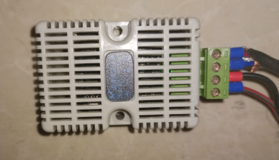
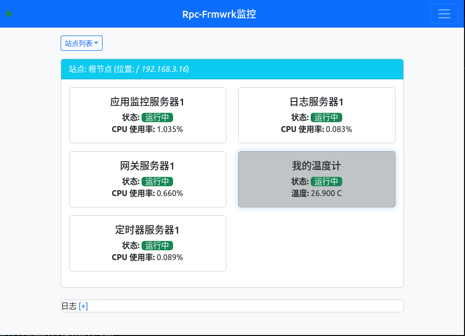
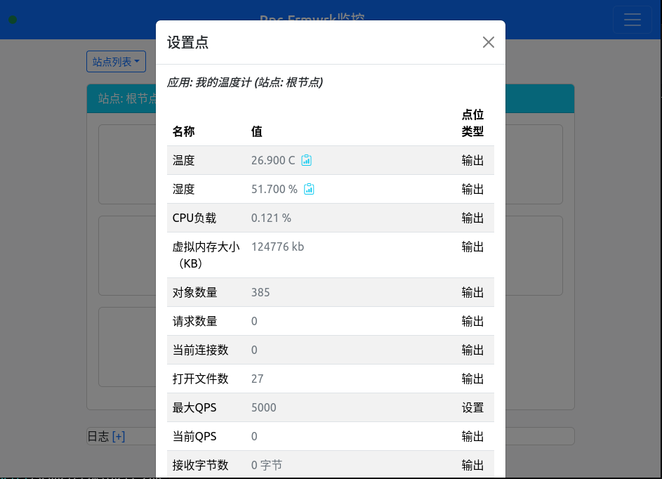
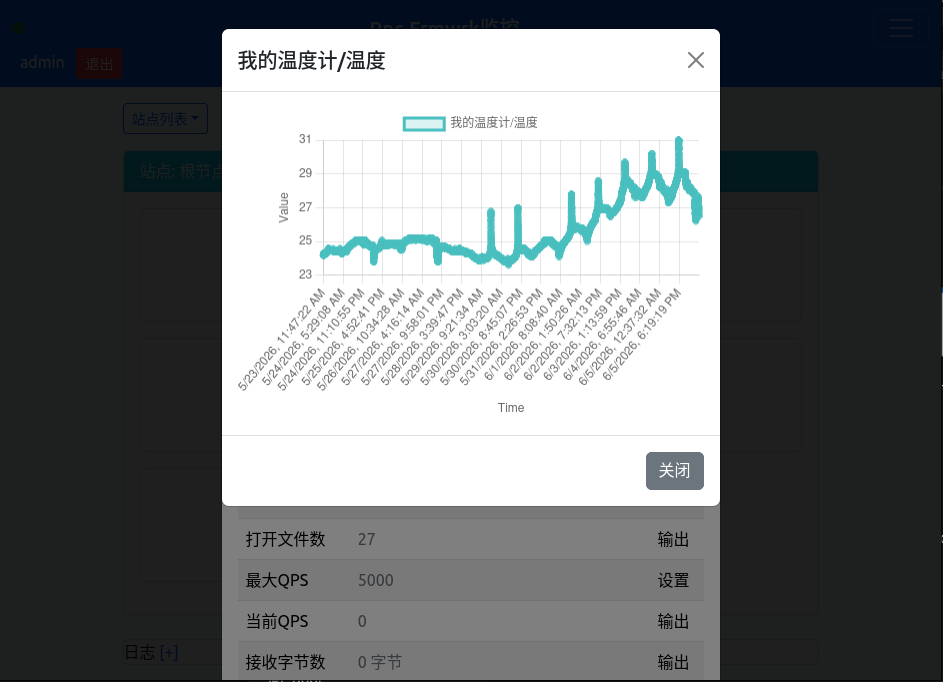

# 如何手搓一个观察记录温度的监控程序
本文将介绍如何使用`rpc-frmwrk`做一个定时记录温度湿度的监控程序。

## 硬件准备
* 主机可以是安装好Linux的PC, 笔记本或者嵌入式开发板，本文使用的是树莓派。
* 一个使用RS485的温度传感器，大概10多块钱，自带485接口的。   

* 一个USB转485的转接器，连接好后。硬件功底好的同学也可以直接把485的连接线焊到树莓派的GPIO上。

## 安装和配置rpc-frwmrk及监视功能
* 安装和配置rpc-frmwrk的说明可以参考这篇[文章](../../../docs/Tut-HowToBuild_cn-9.md)。
* 启用监视功能配置说明请参考这篇[文章](../../../monitor/client/js/appmoncli/README_cn.md)。

### 向rpc-frmwrk注册一个名为'thermometer'的app.
* 运行目录下的`bash adddev.sh thermometer`，完成注册。
* adddev.sh在rpc-frmwrk的app数据库中添加了一个新的app, 并为这个app设置两个特殊的点位，一个名为`temperatue`,一个名为`humidity`。这两个点位将会展现在监视器的页面中。

### 生成一个支持rpcf-frmwrk监视功能的程序框架
* 运行目录下的cmdline文件即可。注意我们在这个文件里已经引用了`thermometer`这个名字，。接下来我们的所有操作都默认是对这个注册的app进行的。
* 我们使用的是python的框架，一是python的工具很丰富，实现起来很方便，二是这个app没有性能方面的特殊要求，用python足够了。

### 改写mainsvr.py
* 我们改写的思路是，加入一个无限的循环，在循环里读取温度传感器的寄存器，然后再写到温度的日志中。`rpc-frmwrk`监视器的网页客户端就可以自动的展示温度的历史信息。
* 为此，我们使用了一个名为`pymodbus`的模块。这个模块可以很方便的进行modbus通信，而不用我们逐个字节的去写tty文件。安装`pymodbus`可以运行命令`pip3 install pymodbus`或者`apt install python3-pymodbus`。
* 对mainsvr.py的修改，已经在该文件中作了详细的注释。

### 温度数据是如何展示的   
* `thermometer`注册成功后出现在rpc-frmwrk monitor的web页面上。   
   

* `thermometer`的详情页。   
   

* 温度历史数据的展示   
  

## 总结
以上，我们展示了如何使用rpc-frmwrk的监视功能，简单方便的实现温度的监控程序。可以说经过简单的定制，rpc-frmwrk成为一个功能强大的IOT平台。今后我们还会实现一些把AI模型整合到监控系统的用例，以供参考，敬请期待。