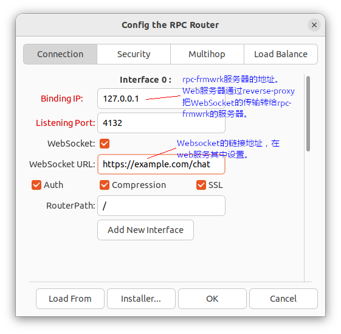
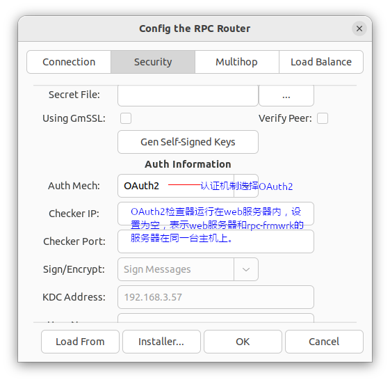

### 简介
`rpc-frmwrk`的JavaScript模块是一个运行在浏览器中的功能全面的客户端。用户可以通过`ridlc`生成的JS框架，添加适当的业务逻辑，即可访问已有的`rpc-frmwrk`服务器。JavaScript模块的优势是部署快速，且跨平台。

### 技术特点
`rpc-frmwrk`的JavaScript依赖于html5，通过`websocket`和`rpc-frmwrk`的服务器通信。JS的运行库一部分运行在浏览器的`web-worker`上，另一部分运行于`main-thread`上，确保后台RPC传输和前台页面展示不会互相影响。JavaScript模块和Python，Java的客户端一样，可以连接所有类型的`rpc-frmwrk`的服务器，不同之处则是JavaScript的客户端是完全独立的，不依赖C++运行库，而Python和Java的客户端跑在C++的运行库之上，以获得更好的性能和扩展性。由于B/C和C/S授权模式的不同，JavaScript客户端不支持Kerberos认证，不过下一步，`rpc-frmwrk`服务器将添加OAuth2.0的支持，弥补JS客户端的认证功能。

### 注意事项
所有的JS例子程序的部署的链接均被设置为假想的`http://example.com/rpcf`。所以用户在开发时，务必使用`ridlc`的`--odesc_path`选项，将其替换成真实的网络地址。

### 部署
下边简要介绍部署支持JS客户端的基本流程。
#### 服务器的部署
服务器的配置
1. 运行命令`python3 /usr/bin/rpcf/rpcfg.py`，打开配置工具界面。
2. 配置WebSocket如下图，如果无OAuth2认证，去掉`auth`旁的勾选，并跳到第四步。
   * 
3. 选择认证方法
   *  
4. 选择OK，将更新本地系统，选择安装包，将生成用于部署到目标机器的安装包。

#### 如何生成和部署JS的skeleton代码
我们以[hellowld.ridl](https://github.com/zhiming99/rpc-frmwrk/blob/master/examples/hellowld.ridl)为例. 假设目标网站的rpc-frmwrk服务的url为`https://example.com/rpcf`
1. 运行`ridlc -J --odesc_url=https://example.com/rpcf --auth -O . hellowld.ridl`，生成客户端网页和JS代码。如果无OAuth2，可以删除`--auth`选项。
2. 在当前目录下运行`make`将用`webpack`打包生成的JS代码并存放在`./dist`目录下。
3. 将`./dist`目录,`HelloWorld.html`和`HelloWorlddesc.json`拷贝到目标目录下。该目录应该已经在`nginx`或者`apache`的配置中设置好，例如`/var/www/html/rpcf`.
4. 在浏览器中, 打开网页`https://example.com/rpcf/HelloWorld.html`。输出结果在浏览器调试窗口的控制台中。
5. 有关OAuth2的更多信息请参考这篇[说明](../rpc/security/README.md#oauth2-support)

