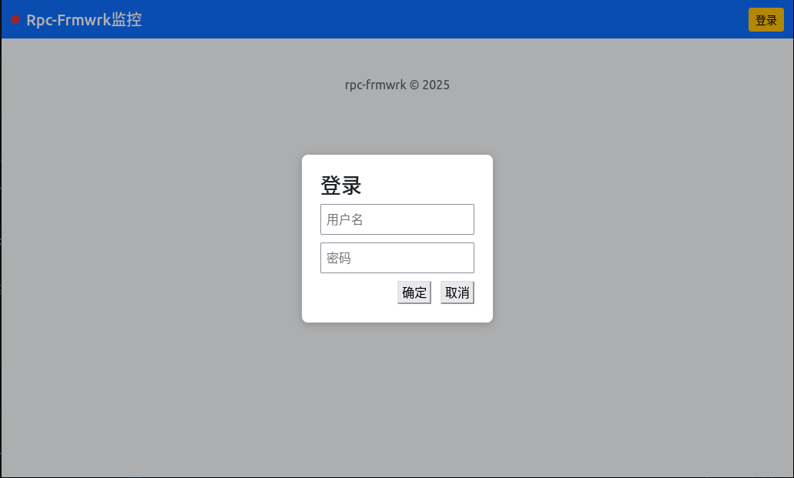
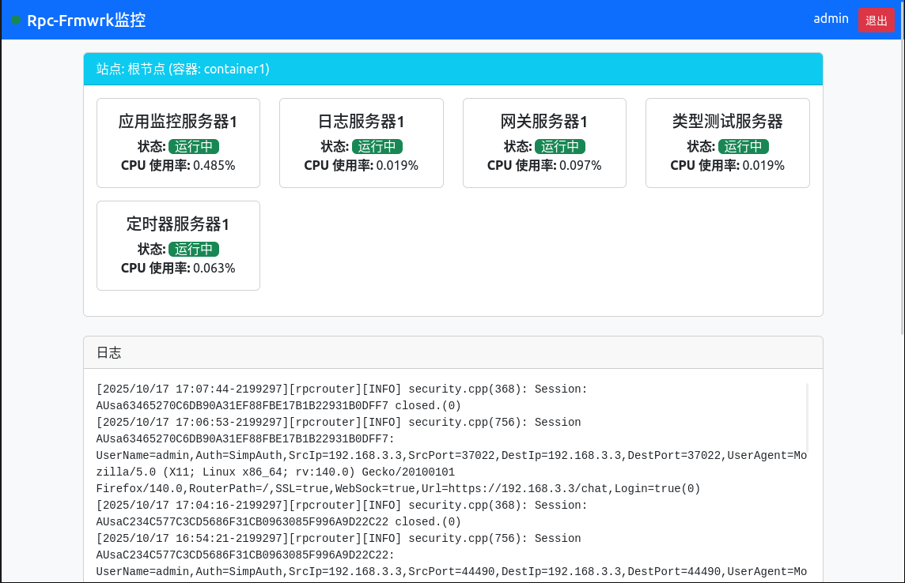
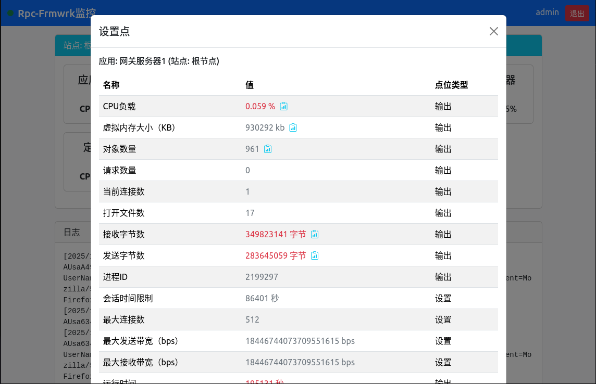
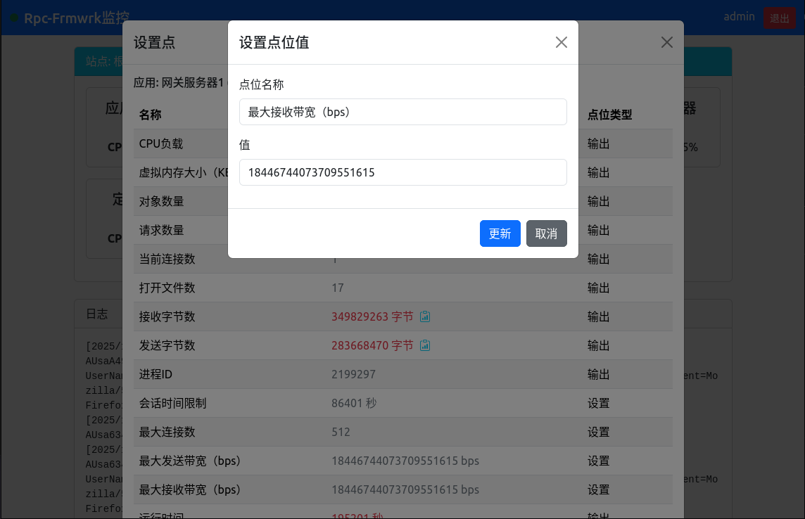
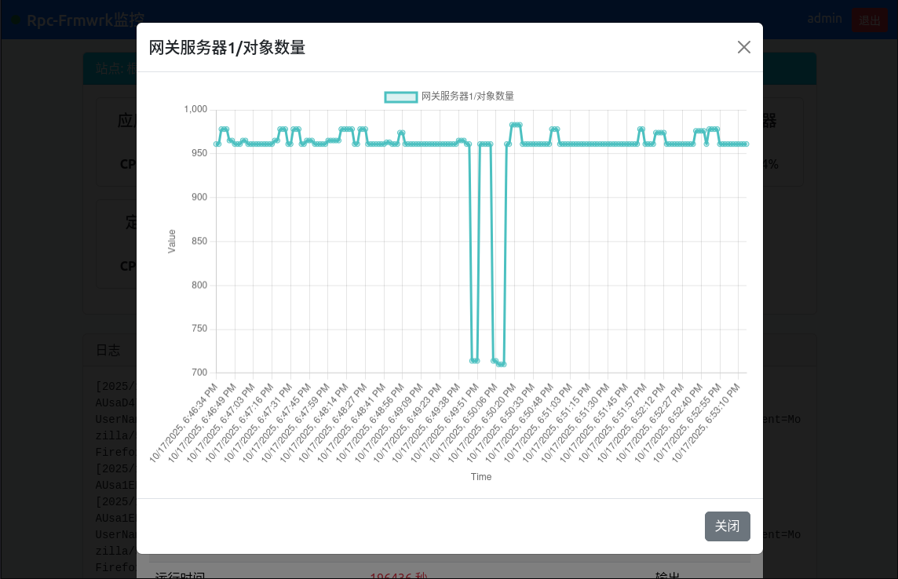

[English](./README.md)
### 功能简介
   * 本监视器可以监控服务器上部署的`rpc-frmwrk`的所有应用程序，提供实时数据和设置运行参数。
   * 本监视器也可以监视以`multihop`方式连接到`rpc-frmwrk`的网关服务器的设备的运行。
   * 本监视器使用`用户名+密码`的方式登陆，后端可以接内建的`SimpAuth`认证，或者第三方的`OAuth2`认证。

### 编译部署和使用网页版Rpc-Frmwrk监视器
   * 首先在本地机器上下载rpc-frmwrk的源代码，并成功编译和安装rpc-frmwrk到目标机器。目前监视器未打包进rpc-frmwrk的安装包，所以要在源码的目录下进行编译和打包。
   * 确保目标机器安装了`nginx`和`npm`。`apache`也可以使用，不过目前还没测试。
   * 通过命令`rpcfctl cfg`配置Rpc-frmwrk，开启Websocket，SSL和SimpAuth选项。密钥可以导入已有的密钥，或者在配置程序里生成自签名密钥。配置程序也可以完成对`nginx`的设置。假设你配置的Websocket网址是`https://127.0.0.1/rpcf`，`nginx`的网站根目录为`/var/www/html/rpcf`。接下来，我们将以此配置讲解使用方法。如何使用`rpcfctl cfg`，可以参考[这篇文章](../../../../tools/README_cn.md#连接页connection)。
   * 通过命令`rpcfctl initsvr`建立监视器运行环境。该命令将建立`用户注册表`和`应用注册表`，和一个`admin`用户。
   * 在命令行下，切换到本`readme`文件所在的目录。
   * 运行命令`../../../../ridl/.libs/ridlc --noreadme --services=AppMonitor -sJO . ../../../../monitor/appmon/appmon.ridl`补全框架缺失的部分代码。
   * 运行命令`make -f Makefile.skel`将在`dist`目录下生成打包好的rpc-frmwrk支持库。待部署的文件包括`dist`下的所有文件，
   `locales`下的所有文件，和当前目录下的`appmon.html`, `appmondesc.json`, `appdetail.js`, `i18n-helper.js`。把这些内容全部拷入`/var/www/html/rpcf`下面，并保持目录结构不变。样例脚本如下：
   ```
    #!/bin/bash
    sudo cp appmon.html appmondesc.json i18n-helper.js appdetail.js /var/www/html/rpcf/
    if [[ ! -d /var/www/html/rpcf/dist ]]; then
    sudo mkdir /var/www/html/rpcf/dist
    fi
    sudo cp dist/* /var/www/html/rpcf/dist/
    if [[ ! -d /var/www/html/rpcf/locales ]]; then
    sudo mkdir /var/www/html/rpcf/locales
    fi
    sudo cp ./locales/* /var/www/html/rpcf/locales/

   ```
   * 现在通过命令`rpcfctl startall`启动后台的程序。
   * 最后打开浏览器，在地址栏输入`https://127.0.0.1/rpcf/appmon.html`即可。
   * 提示输入用户名和密码时，可以输入`admin`和账号的密码。
   * 如果你希望业务服务器也可以被监控程序管理，可以通过一下步骤实现：
      * 可以在生成业务服务器框架代码的`ridlc`的命令行加上 `-m <应用名称>`，更新相关的代码。该选项只影响服务器端代码。
      * 使用命令`rpcfctl addapp <应用名称>`注册该程序。
      * 手工运行一次该服务器，以便其注册启动信息和其他一些实例信息。
      * 此时该应用已经可以通过监视器网页进行监控了。
      * 关于如何定制监视的内容，不久将会有新的文章进行叙述，请耐心等待。
   * 下面是监视器程序的一些用户界面：
   * 登陆界面   
   
   * 主界面   
   
   * 应用详情页面   
   
   * 更改配置页面   
   
   * 查看设置点位日志页面   
   