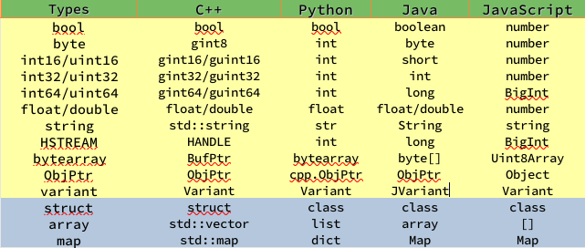

[English](./README.md)
### 简介

* `ridl`就是`rpc idl`的意思, 即远程调用接口描述语言. `ridlc`意即`ridl`的编译器。 本模块的目的在于提供一个`rpc-frmwrk`的快速开发工具。该工具可以通过给定的`ridl`文件快速生成骨架客户端和服务器端应用的源文件, 当然也包括该应用的配置文件和Makefile. 目前`ridlc`支持生成C++, Python和Java应用的项目骨架.   
* `ridlc`可以有效减少开发人员的学习时间，把精力投入到业务逻辑的开发中. 当然如果以学习`rpc-frmwrk`为目的，也可以参考`../test`的例子程序，手工编写`rpc-frmwrk`应用程序.
* 下面的代码片段是`ridl`文件的样例:

```
// `appname` is a must-have statement
appname "example";
typedef array< array< string > > STRMATRIX2;

struct FILE_INFO
{
    /* define the fileds here, with default value optionally*/
    string szFileName = "test.dat";
    uint64 fileSize = 0;
    bool bRead = true;
    bytearray fileHeader;
    STRMATRIX2 vecLines;
    map<int32, bytearray> vecBlocks;
};

// echo different type of information
interface IEchoThings
{
    // synchronous call on both server/proxy side by default.
    Echo( string strText )
        returns ( string strResp ) ;

    // server/proxy both sides asynchronous
    [ async ]EchoMany ( int32 i1, int16 i2,
        int64 i3, float i4, double i5, string szText )
        returns ( int32 i1r, int16 i2r,
            int64 i3r, float i4r,
            double i5r, string szTextr );

    // server side asynchronous, and proxy side synchronous
    [ async_s ]EchoStruct( FILE_INFO fi ) returns ( FILE_INFO fir );

    // An event Handler
    [ event ]OnHelloWorld( string strMsg ) returns ();
};

service SimpFileSvc [ stream ]
{
    interface IEchoThings;
};
```

### `ridl`支持的数据类型

`ridl` 支持十种基本数据类型和三种复合数据类型.
基本数据类型包括:

* **byte** : 单字节无符号整型.
* **bool** : 单字节布尔型.
* **int16/uint16** : 双字节有符号和无符号整型.
* **int32/uint32** : 4字节有符号和无符号整型.
* **int64/uint64** : 8字节有符号和无符号整型.
* **float(32)/double(64)** : 32位和64位浮点数.
* **string** : 字符串类型 
* **bytearray** : 字节数组.
* **ObjPtr** : `rpc-frmwrk`内建的可序列化对象指针(Javascript不支持此类型)
* **HSTREAM** : 数据流句柄，用于在客户端和服务器端指定数据流的实例.

三种复合类型数据包括：

* **array** : `数组`由一组基本类型或者符合类型的元素构成，数组不支持`HSTREAM`元素类型. 
* **map** : `映射表`由一个或多个键(key)值(value)对组成.  `key`必须是可比较的数据类型, `value`可以是除`HSTREAM`外的任何类型。
* **struct**: `结构体`如上面代码中的 `FILE_INFO`所示, 是一组不同类型数据的集合，可以 通过字段名称进行访问的数据类型. 

上述各数据类型在`ridlc`生成目标语言的`实现`时，会转化成目标语言对应的数据类型。下图是`ridl`的数据类型和各个语言的数据类型的对照表.   
.

### 语句

上面的例子已经展示了大部分`ridl`支持的语句。`ridl`现在支持7种类型的语句。

* **appname** : 用于指定应用程序的名称，这个名称必须是个合法的标识符。`appname`是一个必须存在的语句, 如果有多个 `appname` 语句, 那么`ridlc`将使用最后一个出现的`appname`.
* **include** : `包含`语句指示编译器包含一个外部的`ridl`文件. 例如, `include "abc.ridl";` 
* **typedef** : `typedef`为一个基本数据类型或者复合数据类型起一个别名. 例如,`typedef myint int32;`
* **const**: `const`给一个常量定义一个名字. 例如, `const i = 2;`
* **struct** : `struct`定义一个`结构体`.由`struct id`和一组字段声明组成。`struct id`必须是一个合法的标识符，字段声明和Java, C++类似，包括`类型`和`字段名称`两部分。
* **interface** : `interface`定义一个接口， `接口`包含一组逻辑上相互联系的方法，以完成某个功能。接口定义由`interface id`和一组`方法`声明构成，类似于面向对象的语言中的`类`的定义. 

  * **interface id**: `inerface id`必须是一个合法的标识符。`interface id`最终会出现在目标对象的地址中，被`rpc-frmwrk`用来定位服务器端的某个`服务`上的`接口`.
  * **method** : `方法`是服务器和客户端交互的最小单位。如例子所示，`ridl`的`方法`声明包含一个`方法名`, `输入参数列表`和`输出参数列表`。除此之外，它还可以有一些`属性（attribute)`标签用来指定如何发送和处理请求。 目前支持的属性有:

    * **async, async_s, async_p** : 指示编译器生成异步或者同步的客户端或服务器端代码, 未指定时将默认生成同步的代码. `async_s` 就是在服务器端生成该`方法`的异步的处理程序, `async_p`就是在客户端生成该`方法`的异步请求程序, `async` 就是`发送程序`和`处理程序`都是异步的. 
      * *Asynchronous* 的意思是在客户端， 一个发出的请求还未收到服务器的`回应`就立即返回，在服务器端就是，一个客户`请求`尚在处理中，调用者就返回去做其他的任务。特别的在`rpc-frmwrk`的上下文中,任何一个`调用`返回的状态码为STATUS_PENDING时, 就是通知`调用者`，处理还在进行中，处理结束时，会调用约定的`回调函数`通知结果.
      *  *Synchronous* 的意思就是客户端，发出一个`请求`后，必须等待并收到服务器的`回应`，才返回控制权给调用者，在服务器端，就是当前的`客户请求`必须处理完成，再进行下一个任务。 一个调用必须返回一个确定的状态码, 要么成功要么失败, 不能返回STATUS_PENDING.
    * **timeout** : 用以指定该`方法`必须在指定的时间内完成，否则将返回超时错误，数值的单位是秒。客户端和服务器端都会遵守这个限制。不过也可以通过设置keepalive的时长，延长请求的处理时间。
    * **noreply** : 标记该`方法`不需要发送任何信息给客户端. 在客户端，请求发送完就返回`成功状态码`。当该请求到达服务器端， 服务器会和普通请求一样处理，但不会给客户端发送任何`响应`.
    * **event** : 标记该`方法`是一个从服务器到客户端的事件。这时客户端生成的是事件处理代码，服务器端生成的是事件发送代码。`事件`处理和`请求`处理是相反的过程，而且事件是广播的属性，客户端不能给服务器发送`事件`的`响应`。
  * **输入参数列表** 和 **输出参数列表** : 输入参数列表和输出参数列表紧跟在`方法名`后面, 这两个列表都可以为空。一个`方法`即使输出列表为空，客户端也会收到服务器的`响应`，报告该`方法`的执行状态码，当然，标有`noreply`的`方法`除外。

  * **避免方法重名** : 在一个接口声明中重名的方法的不同的语言下会产生不同的效果，有的支持，有的报错。所以建议不要在一个`服务`的定义中使用重名的方法。

* **service** : 声明一个 `服务`。一个服务必须包含一个或多个`接口`, 用以提供逻辑完整的服务. 它包含一个 `服务标识符` 和一组`接口`的引用.
  * **服务标识符**: `rpc-frmwrk`会将`服务标识符`编入客户端发送的请求中的`ObjPath`字段, 用以定位远程对象。
  * `服务`也有一些`属性`标签，来帮助编译器生成需要的代码.
    * **stream** : 该`服务`需要加入`流`的支持. 如果某个接口的方法定义中有`HSTREAM`类型的参数，那么可以不必添加此属性。

### 启动`ridlc`

`ridlc` 意即 `ridl 编译器`. 命令行的形式 `ridlc [options] <ridl file>`, 主要的命令行选项如下:

```
        -I <path>: 指定查找包含文件的目录. 该选项可以重复使用
                
        -O <path>: 指定输出文件的目录. 如果没有就是当前目录。
                
        -p: 生成Python的框架文件。   

        -j: 生成Java的框架文件。

        -J: 生成JavaScript的客户端框架文件。此选项不支持`-f`选项。

        --odesc_url=<url> :
            指定部署时`object description`文件的`url`。需要注意的是这个`url`不要包含文件名。这个选项是生成JS框架时的强制选项.

        --auth: 生成框架将使用`OAuth2`进行授权认证。该选项仅用于JS框架。
        
        -f: 生成支持`rpcfs`的框架。该框架代码不需要额外编写代码，可以直接执行，并mount为服务器或客户端的文件系统，具体信息请参考`rpcfs`的说明
        
        -P: 指定目标Java包的前缀. 目标Java包的名称形如<prefix>.<appname>, 该选项仅用于Java.
        
        -l: 生成的框架将构建一个shared library. 该选项只适用CPP或者rpcfs.
        
        -L<lang>： 指定生成的README.md的语言。 目前lang可以是"cn"中文，或者"en"英文. 

        -s: 生成的微服务框架通过Unix Socket进行进程间通信，与缺省时通过DBus进行通信不同, 有较小的请求包和更快的请求响应，同时在流量可以进行session级别的控制。不过对打开文件的个数要求是DBus通信的两倍。
        -b: 生成的服务器和客户端框架，不需要rpcrouter进行中转, 省却本地进程间通信，有低的延迟和较高的吞吐量。
```

目前`ridlc`可以生成 C++, Python，Java和JavaScript的应用框架. 

### C++ 项目生成的文件

以上面的`ridl`文件为例, `ridlc`会输出以下的文件:

* **maincli.cpp, mainsvr.cpp**: 这两个文件定义了客户端和服务器端的main函数。这两个文件里都定义了一个和文件同名的函数. 即客户端有个`maincli`函数，服务器端有个`mainsvr`函数，这两个函数可以作为添加业务逻辑的入口之一。

* **SimpFileSvccli.cpp, SimpFileSvccli.h, SimpFileSvcsvr.cpp, SimpFileSvcsvr.h:** 这几个文件的名字由 *service id* 加 `svr` 或者 `cli`构成. 每一个`服务`的声明会产生两对 `.cpp` 和`.h` file, 分别对应客户端和服务器端. CPP文件包含了所有需要在客户端或者服务器端用户添加业务逻辑的方法. 这些方法的名称对应于`ridl`文件中的定义。
标async的`方法`实现的工作量大一些，不过性能方面好很多。对于性能方面要求不高的可以不用标`async`，这样实现起来简单很多。
* *example.cpp, example.h* : 以 *appname*命名的文件包含所有框架代码的声明和实现.
* *Makefile*: 工程文件Makefile包含两个目标, `debug` 和 `release`. 调试版的生成文件将放到 `debug`目录, 发行版的生成文件将放到 `release` 目录. 在编译过程中, Makefile会调用同目录下的`synccfg.py`同步系统设置。当然你也可以手动更新系统设置。
* *exampledesc.json, driver.json:* 配置文件们. `driver.json`是配置`I/O管理器`的文件 。 `exampledesc.json` 包含所有启动`service`的必要信息. 每次你使用`rpcfg.py`更新 `rpc-frmwrk`的系统设置时, 你需要运行一下`synccfg.py`.
* *cmdline* : 记录所执行的ridlc命令行。
* **运行:** 编译成功后, 会生成`examplecli` 和 `examplesvr`两个可执行文件. 如果你生成CPP框架时指定了 `-l` , 生成的二进制代码将会变成 `examplelib.so`.

### Python 项目生成的文件

以上面的`ridl`文件为例, `ridlc`会输出以下的文件:

* **maincli.py, mainsvr.py**:  这两个文件定义了客户端和服务器端的main函数。这两个文件里都定义了一个和文件同名的函数. 即客户端有个`maincli`函数，服务器端有个`mainsvr`函数，这两个函数可以作为添加业务逻辑的入口之一。

* **SimpFileSvccli.py, SimpFileSvcsvr.py:**: 这两个文件的名字由 *service id* 加 `cli` or `svr`构成. 它们包含了所有需要在客户端或者服务器端用户添加业务逻辑的方法. 标async的`方法`实现的工作量大一些，不过性能方面好很多。对于性能方面要求不高的可以不用标`async`，这样实现起来简单很多。

* *examplestructs.py, seribase.py* : `结构`类型定义文件以 *appname*加`structs`命名. 它包含所有所需的struct的定义和序列化的实现, `seribase.py`则是序列化的支持文件，这些文件不需改动。

* *SimpFileSvcclibase.py, SimpFileSvcsvrbase.py:* 这两个文件以 *service id* 加 `clibase` or `svrbase`命名. 它们包含所有的已实现的框架代码，不需用户改动，会在ridlc再次编译时被覆盖。


* *Makefile*: 工程文件. 用于同步应用和系统的设置，在运行之前，必须同步一下系统设置。
* *exampledesc.json, driver.json:* 配置文件们。
* **运行:** 在命令行执行`python3 mainsvr.py` 和 `python3 maincli.py` 分别启动服务器和客户端. 

### Java 项目生成的文件
* **maincli.java**, **mainsvr.java**: 如文件名所示，这两个文件包含 `main()`客户端和服务器端的`main`函数. 如果这两个文件存在于目标目录，`ridlc`在下一次重新编译时，会把新的文件写入到`.new` 为后缀的文件中，保留改动不变。

* **SimpFileSvcsvr.java**, **SimpFileSvccli.java**: 这两个文件的名字由 *service id* 加 `cli` or `svr`构成. 它们包含了所有需要在客户端或者服务器端用户添加业务逻辑的方法. 标async的`方法`实现的工作量大一些，不过性能方面好很多。对于性能方面要求不高的可以不用标`async`，这样实现起来简单很多。
 和上面两个文件一样，如果这两个文件存在于目标目录，`ridlc`在下一次重新编译时，会把新的文件写入到`.new` 为后缀的文件中，保留改动不变.

* *SimpFileSvcsvrbase.java*, *SimpFileSvcclibase.java* : 这两个文件以 *service id* 加 `clibase` or `svrbase`命名. 它们包含所有的已实现的框架代码，不需用户改动，会在ridlc再次编译时被覆盖。

* *exampleFactory.java*: 该文件定义了struct工厂类，用于建立ridl中声明并引用到的`结构体`.该文件由`ridlc`维护。

* *`struct id`.java* :这类文件定义了各个在ridl文件中声明并引用的`结构体`，和它们的序列化/反序列化实现。该文件由`ridlc`维护。

* *exampledesc.json* *driver.json*: 配置文件，由`ridlc`生成，可以由同目录下的`synccfg.py`更新。

* *Makefile*: 工程文件. 用于同步应用和系统的设置，在运行之前，必须同步一下系统设置。

* *DeserialMaps*, *JavaSerialBase.java*, *JavaSerialHelperS.java*, *JavaSerialHelperP.java*: 序列化的工具类。每次运行`ridlc`会重写这些文件。

* *synccfg.py*: 一个python脚本用于更新程序的配置文件。
* **运行:** 在命令行输入 `java org.rpcf.example.mainsvr` 或 `java org.rpcf.example.maincli`以启动服务器或者客户端. 注意设置`CLASSPATH`环境变量，确保系统可以找到`rpcbase.jar`

### JavaScript 项目生成的文件
* **maincli.js**: 包含建立`iomanager`和各个`proxy`对象, 以及启动`proxy`的代码。
`ridlc`会留意这个文件作的改动。 当`ridlc`再次编译时，如果发现目标目录存在该文件会把新生成的文件名加上.new后缀，避免覆盖原文件。

* **SimpFileSvccli.js**: 包含有关service `SimpFileSvc`的客户端的所有接口函数的声明和空的实现。这些接口函数需要你的进一步实现, 其中主要包括服务器端的请求处理和客户端的事件处理。
你可以对这两个文件作出修改，不必担心`ridlc`会冲掉你修改的内容。`ridlc`再次编译时，如果发现目标目录存在该文件，会为新生成的文件的文件名加上.new后缀。

* *SimpFileSvcclibase.js* : 分别包含有关service `SimpFileSvc`的客户端的所有辅助函数和底部支持功能的实现。
这些函数和方法务必不要做进一步的修改。`ridlc`在下一次运行时会重写里面的内容。

* *examplestructs.js*: 包含一个ridl文件中声明的所有用到的struct,以及序列/反序列化方法的实现.
这个文件务必不要做进一步的修改。`ridlc`在下一次运行时会重写里面的内容。

* *exampledesc.json*: 包含本应用相关的配置信息, 和所有定义的服务(service)的配置参数。
这个文件务必不要做进一步的修改。`ridlc`或者`synccfg.py`都会在在下一次运行时重写里面的内容。

* *driver.json*: 包含本应用相关的配置信息,主要是底层的iomanager的配置信息。
这个文件务必不要做进一步的修改。`ridlc`或者`synccfg.py`都会在在下一次运行时重写里面的内容。

* *Makefile*: 工程文件. 此文件有三个`target`, `update`更新配置， `debug` 指示webpack打包整个项目，保留文件的格式，便于调试。`release`指示webpack以紧凑格式打包整个项目，适用于上线文件。

* *webpack.config.js*: 该文件是webpack打包整个工程的配置文件。webpack的输出为以`example.js`结尾的一组js文件。用于在web服务器上的部署。 这个文件务必不要做进一步的修改。`ridlc`会在在下一次运行时重写里面的内容。

* *example.html*: 该文件是一个例子html, 用于展示如何在页面或者打包后外部调用者如何使用客户端程序, 相当于程序的入口。
这个文件如果存在的, `ridlc`下一次编译的输出会写入`.new`文件里。

* *synccfg.py*: 一个小的Python脚本, 用来同步本应用配置信息。

### C++, Python, Java和JavaScript的客户端可以交叉访问其他语言的服务器。
微服务架构的客户端，目前只能访问微服务架构的服务器。C/S架构的客户端可以访问两种架构的服务器。

### `-b`选项生成的`紧凑模式App`的命令行选项
#### 服务器程序的命令行选项
```
	[ -m <mount point> 通过`rpcfs`文件系统把运行时的状态信息以虚拟文件的形式导出，导出的目录为'mount point'. ]
	[ -a 开启认证功能. 具体是kerberos还是OAuth2,视系统配置而定 ]
	[ -d 以守护进程的方式运行. ]
	[ -i <ip地址> 指定服务器绑定的ip地址. ]
	[ -p <端口号> 指定服务器服务的tcp端口号.. ]
	[ -g 发送日志到独立的日志服务器 ]
	[ --driver <路径名> 指定driver.json'的路径. ]
	[ --objdesc <路径名> 指定object description 文件的路径. ]
	[ --router <路径名> 指定router.json'文件的路径. ]
	[ --instname <名称> 指定服务器的实例名称，缺省时，实例名称在object description文件中. ]
	[ -h 帮助信息 ]
```
#### 客户端程序的命令行选项
```
	[ -a 开启认证功能. 具体是kerberos还是OAuth2,视系统配置而定. ]
	[ -d 以守护进程的方式运行. ]
	[ -i <ip地址> 指定要连接的服务器ip地址. ]
	[ -p <端口号> 指定服务器的端口号，缺省时为4132. ]
	[ -k 作为kinit的代理运行. ]
	[ -l <用户名> 以'user name'登陆并退出. 指在'-k'时使用 ]
	[ --driver <路径名> 指定driver.json'的路径.. ]
	[ --objdesc <路径名> 指定object description文件的路径. ]
	[ --router <路径名> 指定router.json'文件的路径. ]
	[ --instname <名称> 指定要连接的实例名称'. ]
	[ --sainstname <名称> 指定要连接的'rpcrouter'的实例名称. ]
	[ --nodbus 客户端不使用dbus通信，用于没有安装dbus的环境中，如docker ]
	[ -h 帮助信息 ]
```

