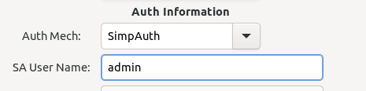

### rpc-frmwrk的认证机制
rpc-frmwrk依靠认证过程来鉴别用户身份并确定是否提供RPC服务。rpc-frmwrk可以通过三种认证协议实施认证。

* Kerberos：Kerberos是一种认证协议，也可以理解成MIT开发的一款实现该协议的认证软件。Kerberos认证协议在企业应用中有广泛的
部署，比如微软的活动目录使用的就是Kerberos认证机制。该认证方式适合部署在以C/S为通讯架构的运行环境中。Kerberos协议是一种
重型且较为复杂的认证协议，可以部署在不安全的环境中，能够有效防范报文被篡改和伪造的风险，也能够防范中间人攻击等。经过几十年的完善
Kerberos被普遍认为是一种安全可靠的单点认证协议(SSO)。Kerberos在希腊神话中是长有三个头的狗，在Kerberos协议中代表着参加认证的三方,
KDC(认证票据发布中心), 服务提供者(rpc-frmwrk server)，和用户方(rpc-frmwrk client)。在认证之前，服务方和用户方需要在KDC处进行注册。
用户名和密码一般通过非互联网的安全方式发布给用户。服务方则会获得一个密钥文件(key table)用于免密码方式的登陆。在简单或者低成本的应
用环境下，KDC和服务提供者可以部署到一台机器上，这时Kerberos协议退化成密码认证。即使这样，由于这个过程不传输密码相关的信息，比起普
通的密码认证过程还是更为安全。

* OAuth2：OAuth2相对Kerberos是一种比较新的认证机制，适和部署在以B/S为通讯架构的环境中。OAuth2相较于Kerberos协议简单直接。
rpc-frmwrk使用的是认证码的授权模式。实际上认证过程是在第三方的服务器上进行，然后对使用RPC的服务进行授权。和Kerberos的三个参与者
不同的是，OAuth2范畴中的三方是OAuth2认证方，OAuth2的资源服务器，和用户方，这个过程并没有rpc-frmwrk的参与。用户方是用户的浏览器，另
外两个是第三方的服务器。比如你使用github的OAuth2，就是github提供的认证服务器，和资源服务器。资源服务器简单的说就是存有你的姓名，
头像，邮件地址等信息的服务器。rpc-frmwrk在认证成功后，通过检查授权的状态来确定是否提供RPC服务。

* SimpAuth: 简单认证协议。这是rpc-frmwrk的内建认证协议，不需要部署第三方软件或者服务器。SimpAuth的流程十分简单，在服务器端添加用户信息，
口令等信息。在客户端，通过工具存储相应的用户名和口令。然后通过rpcfg.py设置系统的认证方式为SimpAuth，就完成了对SimpAuth的设置。认证过程为，
连接建立后，客户端发出加密的token, 服务器解密并验证token后，返回加密的响应token, 客户端验证无误后，即可转入RPC服务。认证服务器是rpc-frmwrk
提供的`appmonsvr`程序。对于简单和快速开发的小型应用，使用SimpAuth是一个兼顾效率和安全的选择。

下面我们分别介绍三种认证方式在rpc-frmwrk中的设置和使用方法。

### Kerberos

##### Kerberos在rpc-frmwrk的认证流程中负责的功能
1. 用户/服务的账号管理。增删改查用户或者服务的账号信息。
2. 发给合法的用户`授权票`, 用户可以使用该`授权票`在获得所在的域(realm, 类似windows下的domain)内的所有服务的使用授权。这个`授权票`
将用户从反复的输入用户名密码的操作中解放出来。
3. 通过交换信息，在用户和服务端建立起安全连接， 并为数据包提供加密/签名服务。
4. 密码的管理和密钥的缓存功能， 限定密码的有效期限，并妥善储存密钥和密码。

##### 部署Kerberos
根据应用场景的不同，Kerberos的设置有所不同。
1. 如果应用在企业环境， Kerberos服务已经上线，例如active directory,你需要和运维人员商量如何添加用户和服务到已有的系统中，以及如何配置KDC
的地址和端口，域名信息等。
2. 如果你打算部署独立运行的KDC，以下步骤可供参考：
    * 安装。以Ubuntu为例，apt install krb5-admin-server krb5-kdc krb5-user libgssapi-krb5-2 libkrb5-3 libkrb5-dev。
    * 选择域名，一般在安装krb5-kdc的时候，系统会提示你缺省的域名是什么。这个域并不完全等同于域名服务的域名，不过也的确会映射到域名服务中，比如
      kerberos的域名是大写的`RPCF.ORG`, 域名服务中的域名按照习惯就写成`rpcf.org`. 互联网的域名并不是必须的。没有条件的用户使用ip地址也无妨。
      不过需要在/etc/hosts中加一些条目.比如`127.0.0.1     rpcf.org`，或者在`kdc.conf`中需要互联网域名的地方，给出ip地址。
    * 然后可以对`krb5.conf`做一些修改。krb5.conf的内容不止下面所列，如果想要详细的了解，可以查阅Kerberos的
    [官方文档](https://web.mit.edu/kerberos/krb5-devel/doc/admin/install_kdc.html#install-and-configure-the-master-kdc)。下面是一个`krb5.conf`的样例。

        ```
            [logging]
                default = FILE:/var/log/krb5libs.log
                kdc = FILE:/var/log/krb5kdc.log
                admin_server = FILE:/var/log/kadmind.log

            [libdefaults]
                dns_lookup_realm=false
                ticket_lifetime =24h
                renew_lifetime =7d
                forwardable =true
                rdns = false
                pkinit_anchors = FILE:/etc/pki/tls/certs/ca-bundle.crt
                spake_preauth_groups = edwards25519
                dns_canonicalize_hostname = fallback
                default_realm = rpcf.org
                default_ccache_name = KEYRING:persistent:%{uid}

            [realms]
            rpcf.org = {
                kdc = kdc.rpcf.org
                admin_server = kdc.rpcf.org
            }
            [domain_realm]
            .rpcf.org = rpcf.org
            rpcf.org = rpcf.org
            
        ```                                                                  
    * 然后安装在KDC的机器上建立KDC的数据库。例如`sudo kdb5_util create -r rpcf.org -s`.
    * 接下来用`kadmin.local`在数据库中添加服务账号和用户账号。如添加用户名`foo`，添加成功后，系统会追加默认的域名如`rpcf.org`。所以最终的用户名是`foo@rpcf.org`。服务名也类似，比如添加`rpcrouter`， 最后的服务名是`rpcrouter@rpcf.org`。如果多台机器上都有`rpcrotuer`的服务，这时服务名也可以`rpcrouter/host1`, `rpcrouter/host2`。最终的服务名就是`rpcrouter/host1@rpcf.org`... 
        * 这里有一点需要说明的是这个服务名是Kerberos系统识别的名字。和`rpcfg`中设置的服务名字略有不同。原因是`rpc-frmwrk`使用的是`gssapi-krb5`的程序接口，它接受的服务名是这样的`rpcrouter@host1`，且不需要追加域名。所以在配置`rpc-frmwrk`的认证信息时需要使用后者。另外`host1`,`host2`也不是随意加的，要么有互联网域名与之对应，要么需要在KDC的本地主机的`hosts`文件里加上对`host1`, `host2`的解析。
        * 还有一点要注意的是，一般情况下，用户账号设置密码，服务账号由于在无人值守的服务器端，以交互方式输入密码的方法不实用，而是使用`key table`来获得认证。`key table`可以由`kadmin.local`导出。我们在后面还会提到。
    * 完成以上步骤之后，就启动KDC了, `/usr/sbin/krb5kdc`。
3. 设置客户端。本文中客户端即指那些部署了`rpc-frmwrk`客户端的设备或主机。
    * 在Ubuntu上，可以运行`sudo apt install krb5-user libkrb5-3 libkrb5-dev`。
    * 把和`KDC`主机上相同的`krb5.conf`拷贝到本机上。
    * 然后运行`kinit foo`，就可以让用户`foo`登陆到Kerberos的域`rpcf.org`了。
    * 如果你的运行环境，没有条件为KDC申请独立的域名和公网IP，又希望客户端可以通过internet访问服务器，`rpc-frmwrk`提供了一个Kerberos的代理通道，可以让`kinit`通过`rpc-frmwrk`把登陆过程传递给防火墙后面的KDC.前面已经说过，Kerberos的认证过程是可以防范第三方窃听和篡改的，所以这个过程时足够安全的。有关客户端的设置的官方文档在[这里](https://web.mit.edu/kerberos/krb5-devel/doc/admin/install_clients.html)。

4. 设置服务器。本文中的服务器指的是部署了`rpc-frmwrk`服务器的设备或主机。
    * 安装过程和客户端的相同。
    * 前面提到过, 服务账号一般不用密码，所以`kinit`这个过程是不必要的。服务器需要一个用`kadmin.local`把`rpcrouter/host1`的凭据信息导出到一个`key table`文件中。系统默认的文件名是`krb5.keytab`。把这个`krb5.keytab`文件拷贝到/etc下面，系统会自动的加载。需要强调的是必须此文件所有者设置成`rpcrouter`的所有者，且读写权限为`0600`。也可以在krb5.conf中设置`default_keytab_name`字段，把`key table`移到用户自己的`HOME`目录下面。有关服务器端设置的官方文档在[这里](https://web.mit.edu/kerberos/krb5-devel/doc/admin/install_appl_srv.html)

5. 配置`rpc-frmwrk`启用Kerberos认证
    * 在服务器和客户端的[driver.json](../../ipc/driver.json)文件中的`RpcTcpBusPort`字段有服务器端的监听地址和端口设置。在这些配置的后面追加`HasAuth:"true"`，将使该端口的新建连接首先进入认证登陆的流程。
    * 在服务器上的[rtauth.json](../router/rtauth.json)文件的`RpcRouterBridgeAuthImpl`字段，需要添加服务方的账号信息。如下面所示：
        ```
            "AuthInfo" :
            {
                "AuthMech" : "krb5",
                "ServiceName" : "rpcrouter@host1",
                "Realm" : "rpcf.org",
                "SignMessage" : "true"
            }                                                     
        ```
    * 在客户端和服务器端的用户`APP`的配置文件，假设该APP叫作`HelloWorld`, 它的配置文件为[hwdesc.json](../../test/helloworld/hwdesc.json)。我们需要在它的Object的描述字段添加用户的账号信息，
        ```
            "AuthInfo" :
            {
                "AuthMech" : "krb5",
                "UserName" : "foo@rpcf.org",
                "ServiceName" : "rpcrouter@host1",
                "Realm" : "rpcf.org",
                "SignMessage" : "true" 
            }
        ```
        这里的SignMessage表示用kerberos的密钥为发送的信息作签名。如果传输协议是SSL的时候，一般没必要加密两次，签名可以节省运算，提高性能。如果SignMessage是“false"，那么将对message进行加密，如果这样，也可以选择不使用SSL.加密算法一般是AES256。不过SSL的性能好像要稍微好一些。有关SSL的详细信息请参考SSL模块的[介绍](../sslport/Readme.md)。
6. 启动rpcrouter时需要加上 `-a`选项。如`rpcrouter -adr 2` 或 `rpcrouter -adr 1`。需要注意的是通信双方的rpcrouter都需要加上`-a`选项。

##### 更多的信息
1. 认证流程的时限是2分钟。如果不能在这个时间段内完成认证流程，该次连接将会被服务器重置。
2. 一般情况下，如果用户的`授权票`过期，连接会在十分钟内被重置。
3. Linux平台下，`kinit`是登陆的首选工具。`klist`是查询登陆信息的工具。
4. 注意服务器和KDC的防火墙是否屏蔽了服务端口。

##### 使用`rpcfg.py`自动配置`rpc-frmwrk`的Kerberos设置
在了解了一系列繁琐复杂的设置步骤并为之头疼的时候，一个好消息是在`rpcfg.py`的安全页面有着配置Kerberos信息的选项。包括自动设置KDC服务器，对于熟悉了原理的用户来说，可以快速的搭建KDC服务器。有关`rpcfg.py`的信息请参考它的[说明文档](../../tools/README_cn.md#rpc-frmwrk配置工具)。

### OAuth2
`rpc-frmwrk`的OAuth2支持主要用于浏览器中的JS客户端，也可用于C++, Python和Java的客户端。OAuth2的认证过程是在`Web应用服务器`(`django`或`springboot`)，OAuth2服务器和浏览器三者之间进行的。认证成功后，`rpc-frmwrk`的客户端将使用`web应用服务器`发给浏览器的认证凭据(cookie)向rpc-frmwrk的`rpcrouter`进行验证。如果通过验证，`rpc-frmwrk`的服务器，比如`HelloWorld`将向获得允许，向用户提供服务。`rpc-frmwrk`使用的是`Authorization code`的认证方式。有关OAuth2的认证流程，在网上十分丰富，这里就不做详细介绍了。

#### OAuth2认证在非JS客户端的使用方法
OAuth2设计上是在浏览器运行的，所以大家对JS下OAuth2的认证界面和流程应该十分的熟悉。而对于非浏览器的`rpc-frmwrk`应用，在初次启动客户端之前，则需要执行一个特殊的命令`oinit`进行登陆，然后客户端才能正常工作。这一点和`Kerberos`的客户端使用方式非常相似。不过，启动客户端前也不必每次都需要`oinit`登陆，这取决于`oauth2`颁发的`auth token`的有效时间。关于`oinit`的使用方法，请参考`oinit`的[使用说明](../../monitor/oinit/README_cn.md)。

#### 与django，Springboot整合的例子
实际上`rpc-frmwrk`和`application server`的通信是通过[oa2check.ridl](./oa2check/oa2check.ridl)的接口完成的。我们在`Web应用服务器`比如`django`或者`springboot`的`app`中整合一个`oa2check`的服务器，就可以轻松的进行验证工作了。

我们在`zhiming99/django-oa2cli-cgi`的镜像仓库中，准备了三个容器镜像，用于演示rpc-frmwrk和不同OAuth2的`实现`的整合。它们分别是`OAuth2-Server`, `django-oa2check`和`springboot-oa2check`。对应的是django的OAuth2的服务器，django的OAuth2客户端app, 和springboot的OAuth2的客户端app。用户可以通过命令行拉取，比如`docker pull zhiming99/django-oa2cli-cgi:OAuth2-Server`。   
**注意**：这三个容器为学习用途，没有启用https. 仓库中还有三个后缀为https的容器，分别对应这三个容器启用https的版本，使用方法同上。

django的OAuth2的客户端app使用的是标准的Authorization code认证流程，springboot的OAuth2的客户端app使用的是OAuth2结合OpenID Connect扩展协议，以提供标准化的身份信息和更安全的身份验证。

##### 容器的使用方法：
* 首先要运行容器`OAuth2-Server`，作为OAuth2的认证服务器。
* 然后如果要跑django和rpc-frmwrk整合的服务器，就启动标有`django-oa2check`的容器。
* 如果要跑springboot的rpc-frmwrk整合的服务器，就启动标有`springboot-oa2check`的容器。

##### 使用中的常见问题：
* 忘记设置ip地址。`OAuth2-Server`的地址被指定为172.17.0.3，而另两个运行rpc-frmwrk的服务器应该为172.17.0.2.
* 使用https版本时，浏览器提示不安全证书。这是由于容器使用的是自签名证书，须选择信任该证书即可。
* 务必在运行`django`或者`springboot`的容器里的`/etc/hosts`文件中， 添加'172.17.0.3  Server-0'。
* JS版`HelloWorld`的输出在浏览器的调试器的控制台窗口中，firefox和chrome可以按F12，显示该窗口。

### SimpAuth
`rpc-frmwrk`的SimpAuth支持所有四种语言，C++，Python, Java和JavaScript.它的优点是设置部署简单快速。

### 如何配置使用SimpAuth
* 通过rpcfg.py在安全页面选择使用SimpAuth认证。
* 用户名一栏指定客户端登陆服务器时使用的用户名。它只对客户端的设置起作用。这个用户名你也可以通过`SimpAuth`的客户端工具`sinit`设置。



### 服务器端启动SimpAuth的认证服务器
* SimpAuth的认证服务器是`appmonsvr`。启动`appmonsvr`, 只需在命令行输入`appmonsvr -d`即可。不过启动`appmonsvr`之前还需确保完成三件事。
    * 设置好密钥，在`rpcfg.py`的安全页中设置, 可以参考`rpcfg.py`的[使用手册](../../tools/README_cn.md#安全页security)。
    * 建立用户账号。如果`appmonsvr`安装在`/usr/local/bin`中（安装在`/usr/bin`下可以依次类推），则使用命令`/usr/local/bin/rpcf/initusers.sh`,建立用户数据库，缺省账号是`admin`。然后通过`/usr/local/bin/rpcf/rpcfmodu.sh -p admin`, 设置`admin`的密码。没有密码的账号不能登陆。你可以通过命令`/usr/local/bin/rpcf/rpcfshow.sh -l`来查看建立的用户。
    * 使用`/usr/local/bin/rpcf/initappreg.sh`, 建立`appmonsvr`的运行数据库。

* `appmonsvr`启动后，在服务器端启动`rpcrouter -adr 2`,客户端启动`rpcrouter -adr 1`。
* 如果你的业务服务器是[`hellowld`](../../examples/cpp/hellowld/), 就在服务器端启动`HelloWorldsvr`.
* 我们将会提供一个简便易用的工具，进一步简化这个流程。

#### SimpAuth认证在客户端的使用方法
如果使用Javascript, SimpAuth的用户界面是登陆对话框，输入用户名和口令后，若验证成功，则客户端可以开始rpc会话。
如果是非Js的客户端，有两步
* 通过命令`sinit -s <用户名>` 设置用户的口令，口令被哈希后加密。如果已经设置过，可以跳过此步骤。如果你有好几个账号可用，通过`sinit -d <用户名>`可以指定默认用哪个账号登陆。
* 启动C++，Python或者Java的客户端。
