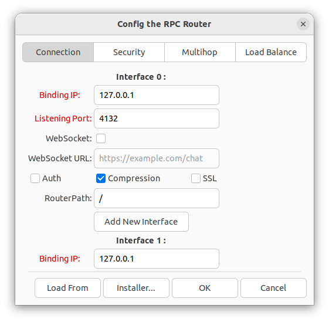
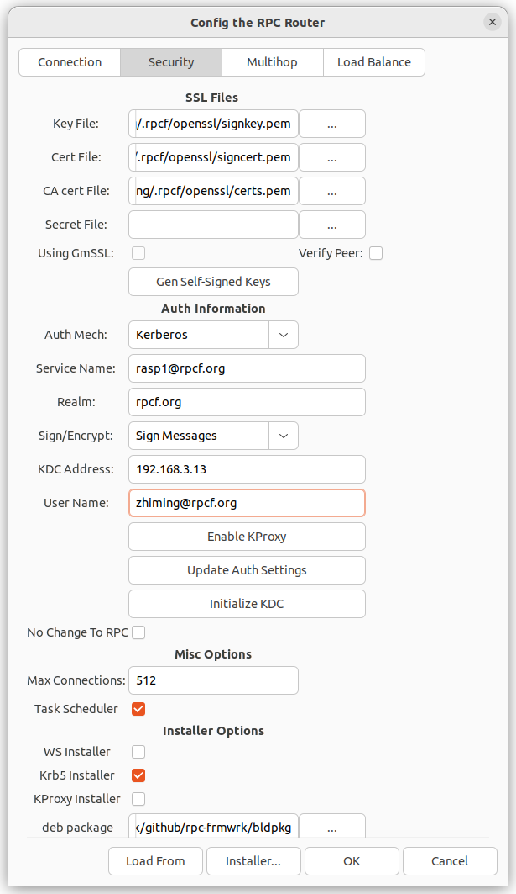

- [RPC Router Config Tool](#rpc-router-config-tool)
- [Quick Start with Dockerfile](#quick-start-with-dockerfile)

### RPC Router config Tool
[`rpcfg.py`](./rpcfg.py) is a GUI tool for rpcrouter configuration. It generate the configuration files including `driver.json, router.json, rtauth.json, and authprxy.json`. Please refer to this [article](../rpc/readme.md), for `rpcrouter`'s concept.
The UI dialog has the following tab pages
* Connection page. Mainly to setup the IP address and port number to listen to remote connections. It is recommended not to use `0.0.0.0` whenever possible. Otherwise, you have to manually setup the destination IP addresses in `router.json`, `rtauth.json` and `authprxy.json`.   
  
  
* Security Page. The infomation on this page takes effect only when you have enabled the related options on the Connection Page. The detailed illustration of generation of key and certification files can be found at [SSL](../rpc/sslport). And the explaination of `Auth Information` can be found [here](../rpc/security#4-enable-authentication-for-rpc-frmwrk).   
  
* Multihop Page. To add or remove the downstream nodes which also provide RPC services to the remote client. And [this link](https://github.com/zhiming99/rpc-frmwrk/wiki/Introduction-of-Multihop-support) is an introduction to `multihop` technology. The parameters are for the current `rpcrouter` to connect to the downstream node, but not for connections from the user clients.   
  
* Load Balance Page. Based on the `multihop` technology, `rpcrouter` can easily be configured to have the `load balance` support. However, currently the `load balance` support just one policy, the `round robin`. And you can refer to [this article](https://github.com/zhiming99/rpc-frmwrk/wiki/Introduction-of-Multihop-support#node-redundancyload-balance) for more information.   
  
  
**Depending** on the location of rpcfg.py, the set of config files updated will be different. If rpcfg.py is under the installation directory, it will update all the config files installed. If rpcfg.py is under the source tree, it will update all the config files under the source tree, which will finally go to the installation directory by `make install`.
`rpcfg.py` accepts a command line option `-c`, to config the local host to be a client only. The UI has just `connection` and `security` tabs.

**[`rpcfgnui.py`](./rpcfgnui.py)** is a command line config tool in case the target host is not running X. There are two steps to get the settings update.
  * Setting up the parameters with rpcfg.py on your desktop host, and uses the `SaveAs`button to generate the config file, `initcfg.json`.
  * copy the `initcfg.json` to the target host, and type `python3 rpcfgnui.py initcfg.json`. You may want to use `sudo` when you are updating the config files in the priviledged directory.
  * `rpcfgnui.py` have the same behavor as `rpcfg.py` in updating the different set of config files according to its location.

### Quick Start with Dockerfile
If you are familiar with docker, you can use this tool to quickly setup the building/running environemt.
  * Open a terminal, and download the `Dockerfile` as shown above.
  * Type `docker build -t 'rpcf-buildenv' .` in the same directory the `Dockerfile` is downloaded.
  * You can tweak `Dockerfile` to customize the image you want to build. Ubuntu Jammy (22.04LTS) is a tested platform, higher version of Ubuntu would be more preferable. 
  * This is a minimum environment without X, and for test purpose the server is set to listening to 127.0.0.1.
  * You can use use `rpcfgnui.py` to update the container's settings as described in the above section.
