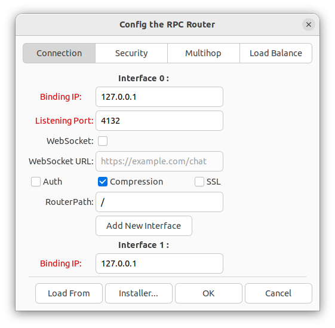
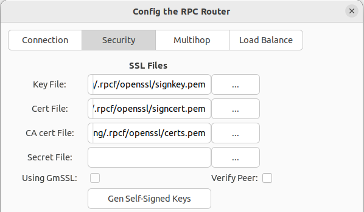
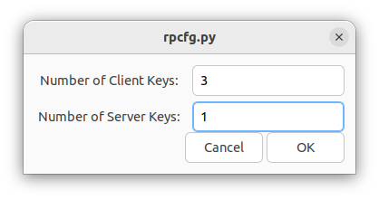
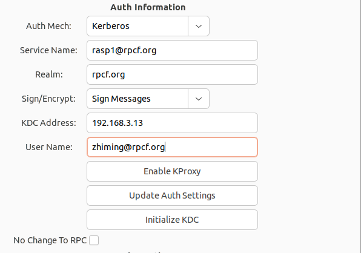
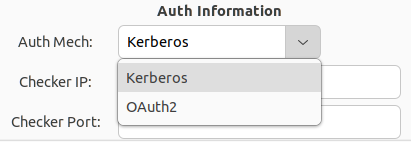
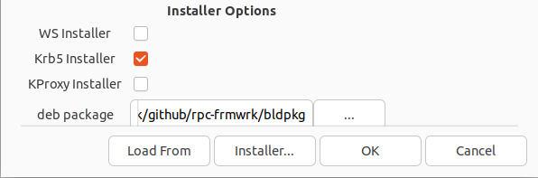
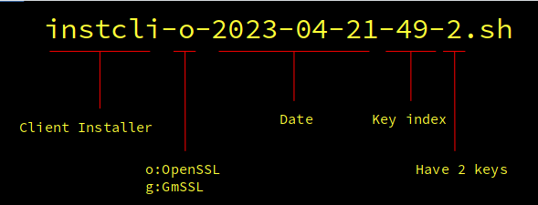
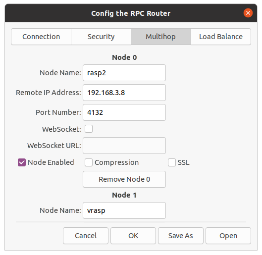

[English](./README.md)
- [rpc-frmwrk配置工具](#rpc-frmwrk配置工具)
  - [连接页(Connection)](#连接页connection)
  - [安全页(Security)](#安全页security)
  - [级联页(Multihop)](#级联页multihop)
- [快速构建rpc-frmwrk的方法](#快速构建rpc-frmwrk的方法)
  - [Docker容器](#docker容器)
  - [使用shell脚本](#使用shell脚本)
  - [注意事项](#注意事项)

# rpc-frmwrk配置工具
[`rpcfg.py`](./rpcfg.py)是一个配置和部署`rpc-frmwrk`的图形化工具。它能够生成`rpc-frmwrk`系统级的配置文件，如`driver.json, router.json, rtauth.json和authprxy.json`。这些文件对于`rpcrouter`或者`紧凑模式`的用户应用程序很重要。同时它也具备简单的密钥管理，Kerberos服务器的自动配置，以及nginx或者httpd的自动配置能力。并且能够生成安装rpc-frmwrk，部署密钥，配置web服务器和KDC主机的安装包，方便部署和维护。

`rpcfg.py`的UI界面是一组在对话框下的标签页，我们将分别介绍`连接页`，`安全页`，`级联页`和`负载均衡页`。
## 连接页(Connection)
  连接页主要用于设置`rpc-frmwrk`服务器的ip地址，端口号，以及传输协议或者选项等。
  * 绑定地址(Binding IP): 对于服务器来说是监听的IP地址。对于客户端来说，则是需要连接的服务器地址。
  * 端口号(Listening Port): RPC服务的端口号。缺省是4132。
  * 安全连接(SSL): RPC连接将使用SSL协议进行加密，具体使用OpenSSL还是GmSSL，密钥的存放等在安全页配置。也就是说所有的连接，如果启用SSL，则会用同一套SSL设置。
  * WebSocket： RPC连接将使用WebSocket协议传输，`WebSocket URL`编辑框里指定进行websocket通信的网络连接。注意这里使用的是https, 而不是wss。处于安全的考虑，启用websocket将强制开启SSL选项。
  * 压缩(Compression)：对传输数据进行压缩。
  * 身份认证(Auth)：对连接用户进行身份认证。具体使用Kerberos或者OAuth2在安全页进行配置。和SSL类似。所有的连接，如果启用了身份认证，那么会用同样的认证设置。
  * 路由路径(Router Path): 客户端选项，指定服务器所在的节点。客户端建立连接的服务器是根节点'/'。隔着根服务器的第二级服务器类似'/fooNode', fooNode是第二级服务器的名称，它的设置信息必须在`级联页`能够找得到。如果还有第三级，如'/fooNode/dev1'，可以访问的前提是，应该保证在'fooNode'的级联页里有节点'dev1'的设置。
  * 添加网络接口(Add Interface): 如果还需要绑定不同的IP地址，可以使用这个按钮添加。
  * 删除网络接口(Remove Interface): 按此按钮将删除按钮上方的设置。
  * 连接页的布局:   
        
## 安全页(Security)
  安全页的`安全连接文件`和`身份认证信息`两部分只有在连接页的某个网络接口启用了安全连接或者身份认证功能时，才生效。  
  * 安全连接文件   
      SSL文件是用于安全连接协议的一组密钥文件。这些密钥文件可以是从证书机构获得的密钥和证书，也可以是自行制作的在内部使用的密钥和证书。这两种证书对于`rpc-frmwrk`来说没有区别，只是第一种证书可能预先安装在了操作系统中。   
        
      * 密钥文件(Key File): 密钥文件路径名。
      * 证书文件(Cert File): 密钥的证书路径名。
      * CA证书(CA cert file)： CA的证书路径名。用于需要`互相验证(Peer Verify)`的场景。
      * 密码文件(secret file): 密钥有密码保护时，该文件存有密钥文件的密码. 
      * 启用国密安全连接(Using GmSSL): 连接将使用GmSSL的国产的安全加密套件(SM2+SM4). OpenSSL一般使用的是RSA+AES。
      * 互相验证(Verify Peer): 在收到对方证书后，先验证证书是否合法，如不合法终止握手流程。
      * 生成自签名密钥(Gen Self-signed Keys): 生成自己签名的密钥和证书。不启用GmSSL时，用openssl命令生成密钥和证书，启用GmSSL时，用gmssl命令生成密钥和证书。
        * 客户端密钥个数(Number of client keys): 要生成/部署的客户端密钥个数。
        * 服务器端密钥个数(Number of Server keys): 要生成/部署的服务器端密钥个数。   
            
        * 自动生成密钥后，`密钥文件`，`证书文件`，和`CA证书`将自动替换成新生成服务器端的密钥和证书的路径名。客户端的密钥和证书一并产生，密钥名为clientkey.pem, 证书名为clientcert.pem, CA证书相同。同时还有serverkeys-x.tar.gz和clientkeys-x.tar.gz产生，方便手工部署密钥。如果用安装包部署密钥的话，则不用记住这些文件。
  * 身份认证信息(Auth Information)   
        
    * 认证机制(Auth Mech): 该下拉菜单目前有Kerberos和OAuth2两项。   
        
    * Kerberos的认证信息:
        Kerberos的详细介绍请参看这篇[文章](../rpc/security/README_cn.md)。
      * 服务名(Service Name), 服务器端的服务名称，比如`rpcrouter@host1`。
      * 域名(Realm), 比如`rpcf.org`。
      * 签名/加密，指定数据包的加密方式。签名是在包尾追加一个数字签名防止伪造，加密费时，更安全。
      * KDC地址(KDC address), Kerberos服务器的ip地址。需要注意的是，如果要生成安装包，那么这个IP地址应该是目标机器可以访问的地址。
      * 用户名，客户端的用户名，用于客户端的设置。
      * 启/停KProxy，KProxy可中继`kinit`的登陆请求，通过`rpcrouter`访问远端的Kerberos服务器. 按此按钮将在本地安装的rpc-frmwrk中启用。如果已经启用，那么停用此功能。
      * 更新本地的身份认证设置(Update Auth Settings)：按此按钮将更新本地安装的rpc-frmwrk的身份认证设置。
      * 初始化本地的Kerberos服务器(Initialize KDC):如果本地机器上安装了Kerberos服务器，可以一按此按钮进行初始化, 包括域名设置，DNS设置，添加用户和服务账号和访问权限，以及设置默认keytab等。
      * 不更新本地`rpc-frmwrk`的设置(No change to RPC)：当勾选此选项后，按`Initialize KDC`和`Update Auth Setting`按钮时，只变更kerberos的设置，不改动`rpc-frmwrk`的设置。
    * OAuth2的信息：
      OAuth2的认证发生在`rpc-frmwrk`之外，所以不需要用户信息。有关OAuth2的详细信息请参看这篇[文章](../rpc/security/README_cn.md#oauth2)
      * OAuth2检查器地址(Checker IP): OAuth2检查器是一个嵌入到`应用服务器`如django，或springboot，或者web服务器的`cgi`中的`rpc-frmwrk`服务器，用于检查指定session的登陆状态。如果检查器和业务`rpc-frmwrk`在一个主机上，这个字段保持空白即可。如果不在同一主机上，填写检查器所在的IP地址。
      * 检查器的端口: 当检查器的IP地址有效时，这里填写检查器的端口号。
  * 杂项(Misc Options)   
        
    * 最大连接数(Max Connections):`rpc-frmwrk`服务器允许的最大连接数。
    * 启用客户端任务调度器(Task Scheduler): 勾选此选项，将在[reqfwdr](../Concept_cn.md#rpcrouter)中启用任务调度器。任务调度器对于有多个客户端，公用同一个reqfwdr时，可以公平调度。该调度器在使用[fastrpc](../Concept_cn.md#fastrpc和builtinrt-app)的项目中并不起作用。
  * 安装包选项(Installer Options)：   
        
    * 配置nginx或者apache服务器(WS Installer): 安装包将根据本地安装的web服务器类型，配置目标机器的web服务器的SSL选项，websocket选项, 并安装服务器端或客户端密钥和证书。
    * 配置Kerberos服务器和用户信息(Krb5 Installer): 安装信息将分为服务方的认证信息和客户端的认证信息，分别进行配置。不过该选项要求该制作安装包的机器也是Kerberos服务器。
    * 启用KProxy功能(KProxy): 安装包将设置客户端，使得`kinit`登陆程序透过`rpcrouter`访问远端的`KDC`。
    * `rpc-frmwrk`的`rpm`或`deb`包的路径(deb/rpm package): 如果制定路径，且`rpm`或`deb`有效，安装包将打包`rpm`或者`deb`文件，并在目标机器上首先安装`rpc-frmwrk`，然后进行设置。
    * `安装包`按钮(Installer)：
        * 将在指定的目录下生成安装包两个，一个是服务器端，一个是客户端。
        * 携带密钥的安装包的名字如下图所示：   
           
        * 命令格式为`bash instcli-o-2023-4-21-49-2.sh 1`, 参数`1`是安装的密钥索引，从0开始计数，小于文件名的最后一个数字。
        * 不携带密钥的安装包名字格式如`instsvr-2023-4-21.sh`, 命令格式为`bash instsvr-2023-4-21.sh`，无参数。
## 级联页(Multihop)
   级联页设置`rpcrouter`的上游`rpcrouter`。从而可以使客户端标记有上游服务器的请求可以被继续上传，直到达到目的地。这样客户端可以在只变更参数`router path`，就可以访问到上游的服务器，而无需作任何代码上的更改。   
       
   * 节点名称(Node Name): 一个标识符, 不能含有字符'/'。长度不超过256字节。 
   * 远端IP地址(Remote IP Address): 上游节点的IP地址。
   * 端口号(Port Number): 上游节点的端口号。
   * 启用WebSocket: 和上游node通过websocket连接。
   * 启用本节点(Enable Node): 只有勾选此项，客户端才能访问本节点。
   * 启用压缩功能(Compression): 对传输数据进行压缩。
   * 启用安全连接(SSL)。
   * 删除本节点(Remove Node X)。

# 快速构建rpc-frmwrk的方法
## Docker容器
  rpc-frmwrk提供了Dockerfile，可以快速的建立编译和运行环境。
  * 打开一个终端，下载[Dockerfile](./Dockerfile)
  * 在Dockerfile的下载目录，运行`docker build -t 'rpc-frmwrk' . `。
  * 你也可以对Dockerfile做一些修改，来时应自己的使用习惯和运行环境。
## 使用shell脚本
  * 下载如下三个文件 [buildall-deb.sh](./buildall-deb.sh), [buildall-fed.sh](./buildall-fed.sh), 和[makerpcf.sh](./makerpcf.sh)到同一个目录下.
  * 在debian或者ubuntu类的平台上执行命令`bash buildall-deb.sh`, 或者在fedora上执行命令`bash buildall-fed.sh`。
  * 你还可以在命令行下载docker镜像 `docker pull zhiming99/rpc-frmwrk:server` 和 `docker pull zhiming99/rpc-frmwrk:client`。注意运行时把服务器端容器ip地址设为`172.17.0.2`,客户端容器ip地址设成`172.17.0.3`。两个镜像里面的`/root`目录下都有`readme.md`，提供简单的提示。这两个容器设置的是使用websoket，所以在容器里需要启动nginx。

## 注意事项
当你使用`rpcfg.py`更新完系统设置后，务必回到你的项目目录下，使用`python3 synccfg.py`命令更新本项目的设置。否则会出现连接失败或者其他奇怪的问题。